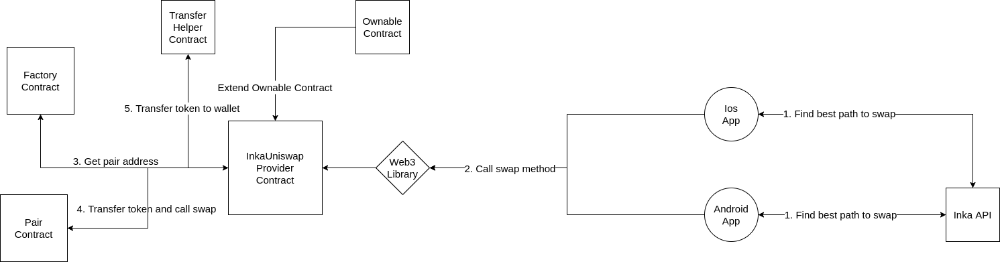

<p align="center">
  <a href="http://inka.finance/" target="blank"></a>
</p>
<p align="center">The most friendly DeFi wallet and aggregator.</p>

## Table of contents

- [Description](#description)
- [How it works](#how-it-works)
- [How to run](#how-to-run)

## Description

Uniswap is an automated market maker (AMM) — decentralized finance (DeFi) application that allows users to exchange tokens, providing liquidity via farming and earning fees in return. Inka wallet integrates with the Uniswap service through smart contracts in the Solidity language, allowing you easy access to adding liquidity to the service.

<p>A smart contract for using the Uniswap service takes a commission that is charged to the Inka wallet.</p>

## How it works

<p align="center">

</p>

<p>Smart contract InkaUniswapProvider is a special layer for integration with the Uniswap service. This layer provides easier access to perform operations on the service.</p>

## How to run

When developing a smart contract, the Truffle framework was used to start the deployment process, you need to set up environment variables and install the necessary libraries

<p>ENVIRONMENT variables:</p>

* INFURA_KEY
* MNEMONIC

```
$ npm install

$ truffle compile

$ truffle migrate --network mainnet
```
